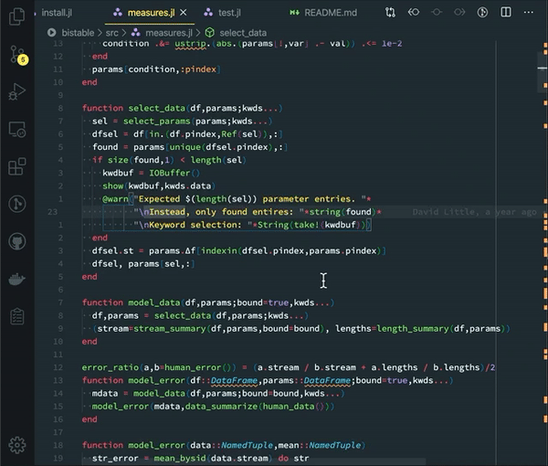

# Select by Indent

This extension adds the command: "Expand Selection by Indentation Level" and
several variants thereof. It works much like other expand selection commands but
uses the indentation level as the cue to determine where and by how much the
selection expands. Repeated calls further expand to shallower and shallower levels. 

Each version of the command differs in how the selection expands in reference to
indentation level. 

- `Expand Selection by Indentation Level (inner)` - Expand the selection
  to all lines with the equal or greater indentation than the currently
  selected lines.
- `Expand Selection by Indentation level (outer)` - Expand the selection
  to all lines at the equal or greater indentation than the currently
  selected lines; then include the lines just above and below this (the outer
  lines).
- `Expand Selection by Indentation level (outer below)` - Expand the selection
  to all lines at the equal or greater indentation than the currently
  selected lines; then include the lines just above and below this (the outer
  lines). If a single line is selected, first clear selection and move
  down one line.
- `Expand Selection by Indentation level (outer top only)` - Expand the
  selection to all lines with the same or greater indentation than the
  currently selected lines; then include the line just above this
  (the top outer line).
- `Expand Selection by Indentation level (outer below, top only)` - Expand the
  selection to all lines with the same or greater indentation than the
  currently selected lines; then include the line just above this
  (the top outer line). If a single line is selected, first clear selection and move down one line.
- `Expand Selection by Indentation level` - Alternate expanding by
   the inner and the outer rules, described above.
- `Expand Selection by Indentation level (top only)` - Alternate expanding by
  the inner and the outer, top only rules, described above.

There are currently no default keybindings. You can add new keybindings by
running the `Preferences: Open Keyboard Shortcuts` command (⌘K ⌘S on mac, or ^K,
^S on windows or linux).
